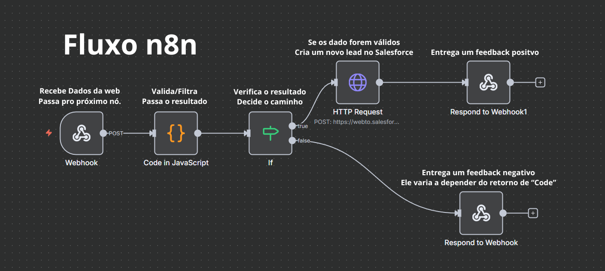
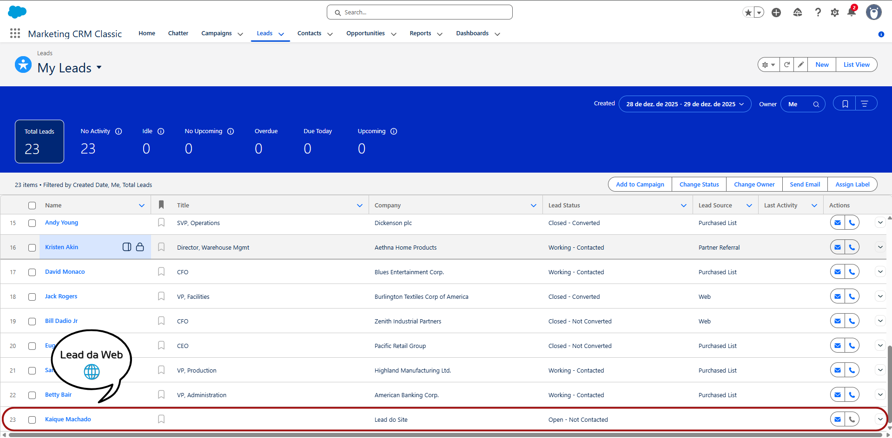

# Integração Landing Page → Salesforce (via n8n)

## Introdução

Este projeto faz parte do meu portfólio e tem como objetivo criar um **fluxo real de captação de leads**, desde uma landing page até o armazenamento dos dados no Salesforce.

Durante o desenvolvimento, algumas decisões precisaram ser ajustadas. Essas mudanças fizeram parte do processo de aprendizado e ajudaram a chegar a uma solução mais simples e adequada ao contexto do projeto.

---

## landing-page

A página é **totalmente funcional** e construída de forma **modular**, pensando em organização, reutilização e manutenção. Apesar de reconhecer o valor da abordagem *Mobile First*, e considerá-la uma boa prática, optei por não utilizá-la neste projeto específico, como uma decisão consciente dentro do escopo proposto.

Minha ideia foi criar uma página de vendas funcional, responsiva e visualmente chamativa, levando em conta tanto necessidades de negócio quanto decisões técnicas.

Na tentativa de equilibrar esses dois lados, algumas escolhas podem acabar parecendo um pouco exageradas ou fora do padrão. Isso foi, em parte, intencional: a proposta aqui não é otimizar um único aspecto ao máximo, mas **explorar diferentes abordagens** e demonstrar conhecimento técnico, estruturação de código e entendimento de contexto.

No fim, este projeto serve como um **exercício prático**, onde priorizei mostrar como penso e decido, mais do que entregar uma página “perfeita” ou idealizada.

---

## n8n — Automação e Validação

O n8n funciona como uma camada intermediária entre a landing page e o Salesforce. Ele é responsável por:

1. Receber os dados enviados pelo formulário via webhook  
2. Validar os campos obrigatórios  
3. Verificar o formato do e-mail  
4. Controlar as mensagens de erro e sucesso exibidas ao usuário  
5. Encaminhar os dados para o Salesforce  

---

## Salesforce — Criação do Lead

O Salesforce é utilizado como CRM para armazenar os leads recebidos.

A integração foi inicialmente tentada utilizando OAuth 2.0, mas houve dificuldades na etapa de autenticação. Como se trata de uma integração simples e com foco em ganho de tempo, essa abordagem acabou sendo desnecessariamente complexa para o objetivo do projeto.

---

## Mudança de Abordagem: Web-to-Lead

Para simplificar o processo, foi utilizado o recurso **Web-to-Lead**, uma funcionalidade nativa do Salesforce.

O fluxo funciona da seguinte forma:

1. O Salesforce gera um formulário HTML oficial  
2. Os nomes corretos dos campos são identificados a partir desse formulário  
3. O n8n envia os dados no formato de formulário (`POST form-url-encoded`)  
4. O Salesforce cria o lead automaticamente  

Essa solução eliminou a necessidade de autenticação via OAuth e atendeu completamente às necessidades do projeto.

---

## Fluxo Completo

### 1️⃣ Visão Geral do Fluxo

---

### 2️⃣ Envio do Formulário pela Landing Page

---

### 3️⃣ Workflow no n8n

---

### 4️⃣ Criação do Lead no Salesforce

---

### Etapas do Fluxo

1. Usuário preenche o formulário na landing page  
2. Os dados são enviados para o webhook do n8n  
3. O n8n valida as informações recebidas  
4. Os dados são enviados ao Salesforce via Web-to-Lead  
5. O Salesforce cria o lead  
6. O usuário recebe uma resposta de sucesso ou erro  

---

## Aprendizados

Com este projeto, aprendi:

1. Como integrar formulários web com um CRM  
2. A importância de validar dados antes de enviá-los  
3. Como usar o n8n para controlar fluxos e respostas  
4. Que escolher uma solução mais simples também é uma decisão técnica  

Este projeto representa meu processo de aprendizado e minha forma de lidar com problemas reais, buscando sempre entender o contexto e escolher a solução mais adequada.
